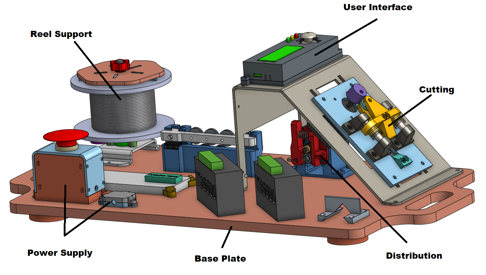

You will find here all the **CAD models** used to build the Jumper Machine. 
we remind you that we have an OnShape repository (if you have a licence)  where their are all our CAD models and assemblies : 

[Jumper Machine 2022/2023](https://cad.onshape.com/documents/e23f2a9b7d5cbfc350862d24/w/3bd71b5e537bce5bc2623e5e/e/d0d5c7eefa7db94f148151a4)

For each of our part on this GitHub project,  you'll have :
- **.STL** if you just want to print the part.
- **.Dxf** if it's a part make by a laser cutting technologie.
- **.pdf** for bending plans for certain parts
- **.FCStd** which allow you to modify the part on a free and open-source CAD software named [**FreeCAD**](https://www.freecad.org/index.php).

# Jumper Machine Nomenclature

